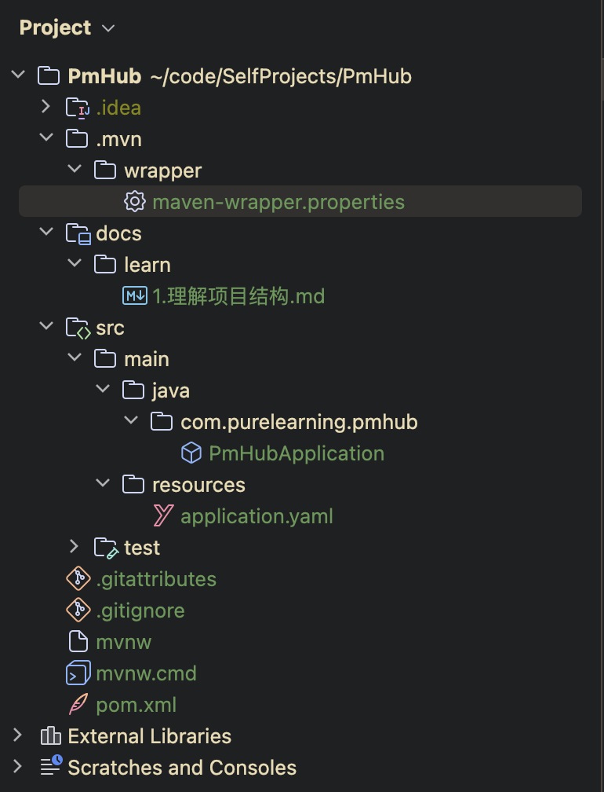

上面的结构是一个 Maven 单体项目结构，其中 pom.xml 是 Maven 的管理文件，src 是源代码所在文件夹，里面的结构是按照约定构成的。

.gitignore 和 .gitattributes 是 git 的配置文件。

mvnw 和 mvnw.cmd 都是用于确保 Maven 是同一个版本的，可以在 .mvn 文件夹中的 maven-wrapper.properties 进行配置。

其余各种文件夹根据需要进行创建并存放文件。